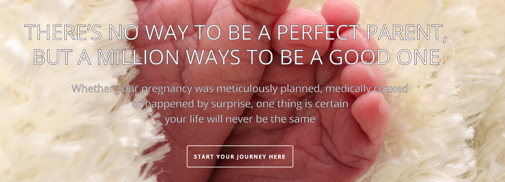

# Where There is Life, There is Love
 

Welcome to my project repo! 
Feel free to take a look around the repo folders, or you can visit my website [here](https://wherethereislife-thereislove.herokuapp.com/)! 
 

If you are interested, you can find out more information about the data here: 
* [Australian Mothers and Babies](https://www.aihw.gov.au/reports-data/population-groups/mothers-babies/data)  
* [Australian Adoptions 1998 - 2019](https://www.aihw.gov.au/reports-data/health-welfare-services/adoptions/data)  
* [National Core Maternity Indicators](https://www.aihw.gov.au/reports-data/population-groups/mothers-babies/data)  

## Project Overview

The ideal goal of this project was to be able to carry out an analysis of data found, in order to make predictions from it, by utilising machine learning. 
 
<u><h3>Why Mothers and Babies?</h3></u>

 
Some would say too personal? Some would say extremely cute - but either way you look at it, so many people around us have a mother, are a mother, would love to be a mother, or is a new mother just finding her feet. There is so many women (and men) out there that feel, alone, overwhelmed or stressed about becoming a parent. 
Expanding on current research and giving parents everywhere fact based information and resources would be an invaluable asset. 
  

### About the Data

 
The data was sourced through the Australian Government and is readily available to anyone who wishes to search for it. However, looking through spreadsheet after spreadsheet, or report after report - is not enjoyable for many people. Having the ability to view the information in a more visual way that is easy to understand and process, makes the information more likely to be understood and remembered. 
  

### Created With

This project was created using the following: 
* Microsoft Excel
* VBA
* Python
* PySpark
* PostgreSQL
* Amazon AWS
* Amazon S3
* Flask
* Mapbox
* D3.js
* Javascript
* jQuery
* Bootstrap
* HTML
* CSS
* Leaflet
* Owl Carousel
* Google Fonts
* Animate.css
* Linear Regression Machine Learning 
* AmCharts

